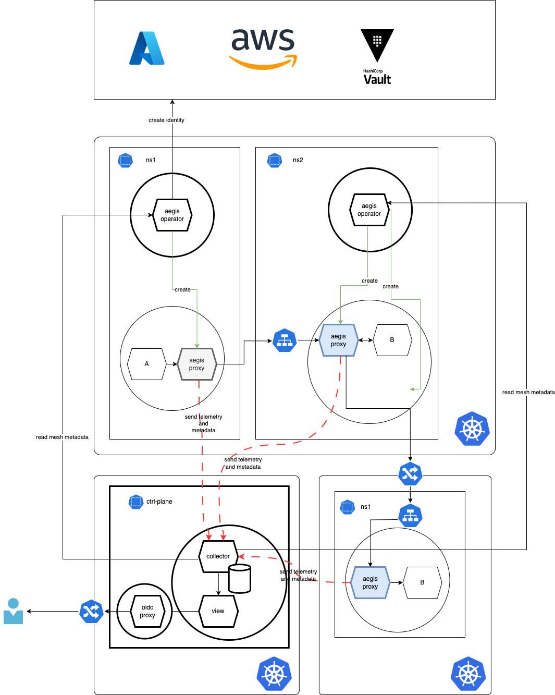

# AEGIS

## Concepts
This solution builds upon the idea of a Service Mesh similar to Istio but with a key difference: instead of securing traffic with mTLS, it relies on JWT tokens issued by external Identity Providers (IdPs) such as HashiCorp Vault, Azure AD, AWS IAM, or GCP. The identities and their associated providers are defined as Custom Resource Definitions (CRDs) in Kubernetes, creating a fully Kubernetes-native approach to identity and access management within the mesh.

## 1. Problem Statement
In this JWT-based Service Mesh:

- Ingress control and Egress token acquisition are handled by a proxy injected into each pod by a mutating webhook.
- The assumption of identities is managed through the federation of Kubernetes ServiceAccounts with the configured IdPs.
- Access control is enforced through CRDs, specifically `IngressPolicy`, which governs the RBAC rules applied by the proxy.

This project implements a mechanism to:

- Securely associate each pod with its identity, defined by its ServiceAccount and federated with an IdP.
- Dynamically manage IngressPolicy resources, ensuring that the proxy in each pod enforces the correct policies without overstepping namespace or cluster boundaries.

## 2. Solution Overview
The solution provides a Kubernetes-native approach to managing and enforcing these policies and identities:

### CRD Definitions:
- IdentityProvider CRDs define external IdPs (e.g., Vault, Azure AD, AWS IAM) and their configurations for token issuance.
- Identity CRDs define the identity to be assumed by the pod
- IngressPolicy CRDs define the allowed identities, methods, and paths for ingress traffic, associated with each pod's proxy.

### Dynamic Proxy Injection:
- A mutating webhook injects the sidecar proxy into pods with specific annotations, enabling ingress and egress traffic control.

### RBAC Enforcement:
- The proxy fetches and enforces the IngressPolicy CRDs specific to the pod using the ServiceAccount identity federated with the IdP.
- Permissions for accessing these policies are managed via Kubernetes RBAC, ensuring strict namespace or cluster-wide isolation.

### Identity Federation:
- ServiceAccounts are federated with external IdPs to allow secure token acquisition.
- The proxy handles token issuance for outgoing requests (egress) and validation for incoming requests (ingress).

### Annotations-Driven Configuration:
- Pod annotations define the configuration for enabling the proxy, selecting the appropriate IdP, and linking to the correct IngressPolicy.

## Tutorials

- Hashicorp Vault 
  - [Setup](./docs/hashicorpvault.md)
  - [Example](./docs/hashicorpvault-example.md)