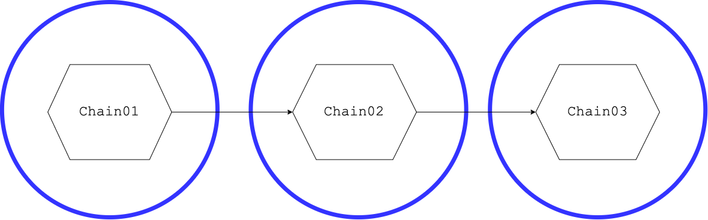
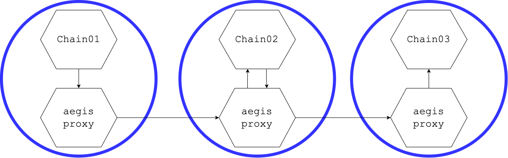

# Example

Let's suppose to have the following situation:
- a pod `chain01` calling a pod `chain02` calling a pod `chain03``





We want to secure the traffic among the pods with a jwt token issued by Hashicorp Vault.


1. Vault CR

Create the CR representing the Hashicorp Vault as in:

```yaml
apiVersion: aegis.aegisproxy.io/v1
kind: HashicorpVaultProvider
metadata:
  name: vault-local
spec:
  name: vault-local
  vaultAddress: http://127.0.0.1:8200
```

This CR doesn't do anything but instructs the webhook to look for that specific Hashicorp Vault installation

2. Identity Creation

Let's create tow identities:
 - `identity01` for container `chain01`
 - `identity02` for container `chain02`


 ```yaml
---
apiVersion: aegis.aegisproxy.io/v1
kind: Identity
metadata:
  name: identity01
spec:
  name: identity01
  provider: vault-local
---
apiVersion: aegis.aegisproxy.io/v1
kind: Identity
metadata:
  name: identity02
spec:
  name: identity02
  provider: vault-local
```

The two identities are linked to the Hashicorp Vault instance defined in the previous CR.

By applying this CR, the operator does the following:
- creates two identities:
  - `system:serviceaccount:my-namespace:identity01`
  - `system:serviceaccount:my-namespace:identity02`

in Hashicorp Vault
- configures the roles in Hashicorp Vault to allow jwt login with the corresponding  service account token
- creates two service accounts:
  - `identity01`
  - `identity02`

The namespace should have the following objects:

```bash
> kubectl get hashicorpvaultprovider
NAME          AGE
vault-local   41m

>  kubectl get identities
NAME         AGE
identity01   40m
identity02   40m

> kubectl get sa
NAME                          SECRETS   AGE
identity01                    0         42m
identity02                    0         42m
...
```

Now, let's say that we want to protect the application containers as follows:

-  container `chain02` can be only called with a `GET` by `identity01` 
-  container `chain03` can be only called with a `POST` by `identity02` 

Let's define the following `IngressPolicies`:

```yaml
apiVersion: aegis.aegisproxy.io/v1
kind: IngressPolicy
metadata:
  name: policy01
spec:
  paths:
    - prefix: /
      allowedMethods: ["GET"]
      allowedIdentities: 
        - system:serviceaccount:operator-system:identity01
---
apiVersion: aegis.aegisproxy.io/v1
kind: IngressPolicy
metadata:
  name: policy02
spec:
  paths:
    - prefix: /
      allowedMethods: ["POST"]
      allowedIdentities: 
        - system:serviceaccount:operator-system:identity02
```

Now let's protect the containers:

```yaml
---
apiVersion: v1
kind: Pod
metadata:
  name: chain01
  labels:
    app.kubernetes.io/name: chain01
  annotations:
     aegisproxy.io/egress: "true"
     aegisproxy.io/identity: "identity01"
spec:
  containers:
    - image: <some image>
      name: chain01
      imagePullPolicy: Always
---
apiVersion: v1
kind: Pod
metadata:
  name: chain02
  labels:
    app.kubernetes.io/name: chain02
  annotations:
    aegisproxy.io/egress: "true"
    aegisproxy.io/ingress: "true"
    aegisproxy.io/ingress.port: "8080"
    aegisproxy.io/identity: "identity02"
    aegisproxy.io/ingress.policy: "policy01"
spec:
  containers:
    - image: <some image>
      name: chain02
      ports:
        - containerPort: 8080
          name: http
---
apiVersion: v1
kind: Pod
metadata:
  name: chain03
  labels:
    app.kubernetes.io/name: chain03
  annotations:
    aegisproxy.io/ingress: "true"
    aegisproxy.io/identity.provider: "vault-local"
    aegisproxy.io/ingress.policy: "policy02"
    aegisproxy.io/ingress.port: "8080"
spec:
  containers:
    - image: <someimage>
      name: chain03
      ports:
        - containerPort: 8080
          name: http
```

> Note: in the above `yaml` the services and ingress are not defined

The containers are protected by the `aegis-operator` mutating webhook that injects a proxy in the pods: 



Let's have a look at the annotations:

- `chain01`
```yaml
  annotations:
     aegisproxy.io/egress: "true"   # This is an EGRESS Proxy
     aegisproxy.io/identity: "identity01" # The proxy assumes identity identity01
```     

- `chain02
```yaml
  annotations:
    aegisproxy.io/egress: "true"   # This is an EGRESS Proxy
    aegisproxy.io/ingress: "true"  # This is also and INGRESS Proxy
    aegisproxy.io/ingress.port: "8080"   # The ingress port to be protected
    aegisproxy.io/identity: "identity02"  # The identity to be assumed
    aegisproxy.io/ingress.policy: "policy01"  # The policy to be checked in ingress
```     


- `chain03`

```yaml
  annotations:
    aegisproxy.io/ingress: "true"  # This is an INGRESS Proxy
    aegisproxy.io/identity.provider: "vault-local"  # The identity to be checked are issued by the "vault-local" vault
    aegisproxy.io/ingress.policy: "policy02"  # The policy to be checked in ingress
    aegisproxy.io/ingress.port: "8080"    # The ingress port to be protected
```


If we apply this descriptor we should see the following 

```bash
> kubectl get pods
NAME                                           READY   STATUS    RESTARTS       AGE
chain01                                        2/2     Running   0              42m
chain02                                        2/2     Running   0              42m
chain03                                        2/2     Running   0              42m
```

Now, if we define an ingress for the `chain01` pod we should successfully call the chain.

